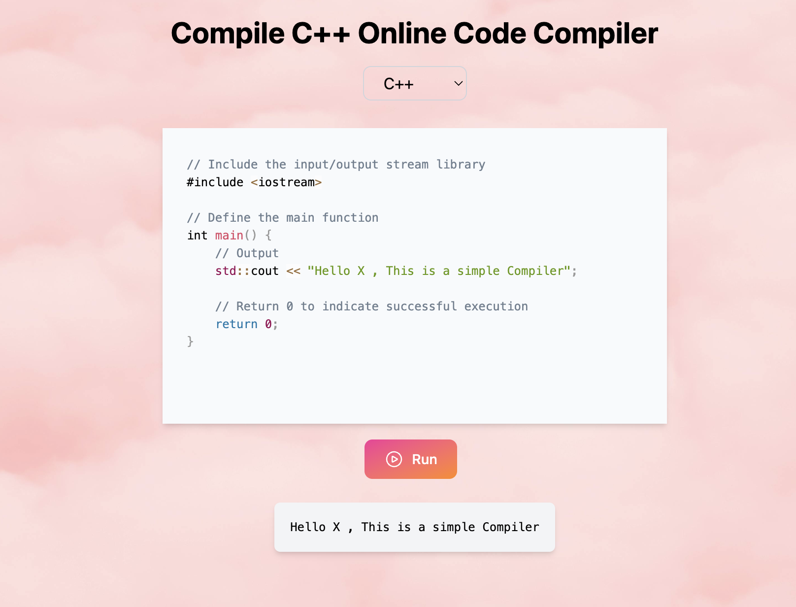
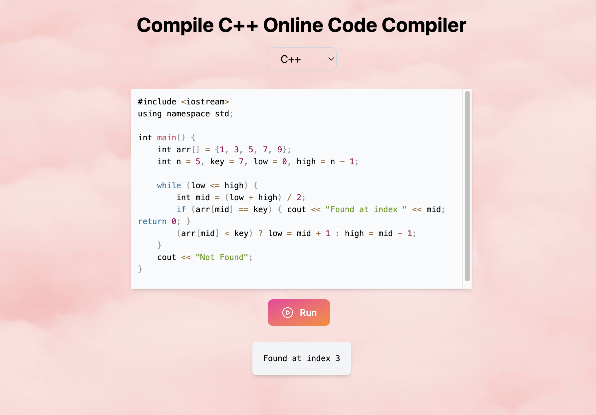

# Code Compiler Microservice

A lightweight microservice built to compile and run **C++ code**.  
This can be integrated into any project requiring a code execution feature.

---

## 🚀 Tech Stack

- **Frontend**: Vite + React (or similar)
- **Backend**: Node.js + Express
- **Languages Supported**: C++
(more languages will be integrated soon)
---

## Create a .env file:

```env
VITE_BACKEND_URL=http://localhost:4000
```

#UI



